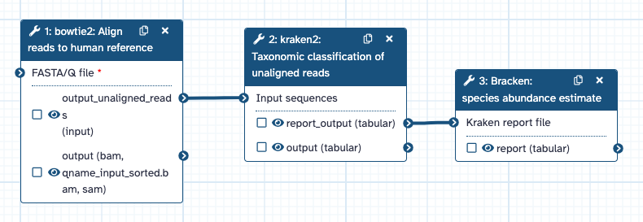
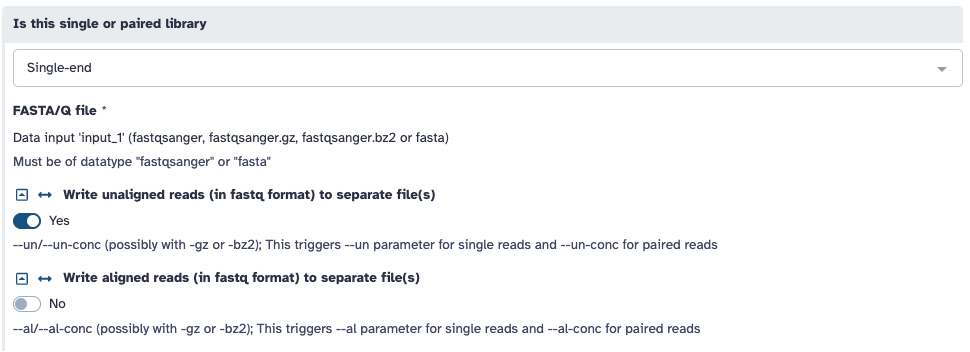
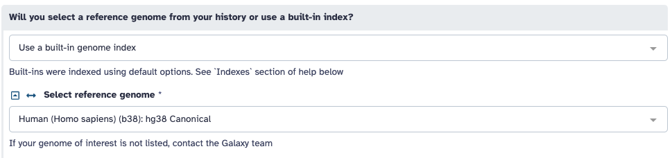
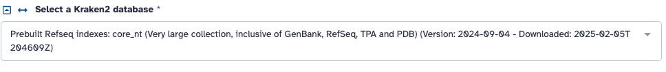
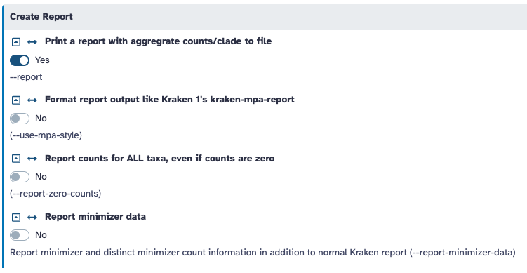
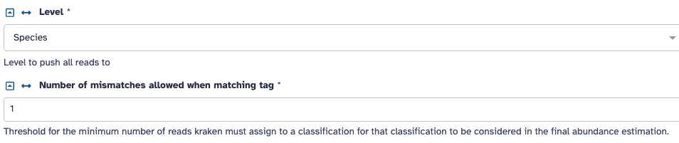
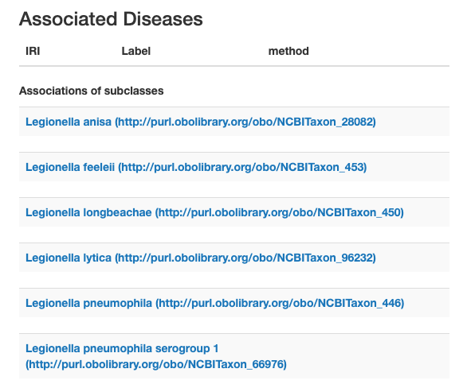
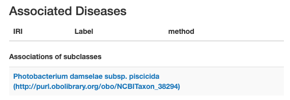

To execute the code blocks in this file, the following software installations are required: R and RStudio. To ensure that all images display properly, the images directory must be kept in the same directory as this RMarkdown file.

To ensure that all necessary R packages are installed, the first code block of the raw RMarkdown file should be run, which is not displayed in the knitted HTML file. To ensure that all necessary dependencies and function definitions have been loaded, please ensure to execute the code blocks in the order that they appear in this document. To execute a block of code, the raw RMarkdown file should be opened in RStudio and the "Run Current Chunk" option may be used.

```{r setup, include=FALSE}
## R set-up
installed_r_packages <- installed.packages()
# Add needed packages to R environment (any that have not already been installed)
needed_r_packages <- c("knitr", "dplyr", "DT", "taxize")
for (package in needed_r_packages){
  if (!package %in% installed_r_packages){
    # Install package
    install.packages(package)
  }
}

## Global code chunk options
library(knitr)
knitr::opts_chunk$set(echo = TRUE)
```

# Background

Sepsis is a life-threatening organ dysfunction that occurs when an infection reaches the bloodstream. This condition increases the in-hospital mortality rate for many patients, including cancer patients [1]. Early intervention is key to increasing the likelihood for survival [1], and that is not possible without early detection. One of the strategies in which sepsis can be detected from a blood sample before observable symptoms occur is through microbial identification in DNA sequencing data [2]. The main advantage of this approach is using hypothesis-free testing, which minimizes the chance that a patient could be misclassified as healthy but really be infected with a pathogen that was not specifically tested for [2]. A typical metagenomics analysis pipeline for this purpose includes pre-processing, removal of human reads, taxonomic classification of unaligned reads, and microbial species identification [2]. 

# Methods

The [pipeline](https://usegalaxy.org/u/ritapecuch/w/taxonomic-classification) described in this project was built under the assumption that the input sequencing data has already been pre-processed, for example adapter trimming [3], as only read sequences were provided without quality score or other supplementary information. In order to keep the run times for this project manageable and to ensure adequate memory and compute resources were available, the selected software tools for many of the steps were ran using the Galaxy web server [4].



## Human DNA Removal

The reads from provided blood samples were first aligned to a human reference genome using bowtie2 [5], and only the unaligned reads were retained for further analysis, as these were the reads that had the potential to be of microbial species origin. While there are several short read aligners available capable of aligning a high percentage of reads [6], the most important factors in this analysis were speed, as the goal is to bring the most prompt monitoring possible to the patients that most need it, and the capability of the software to save unaligned reads and write them to a separate file. Additionally, not all hospitals may be equipped with the software and compute resources needed for large-scale bioinformatics analyses, so it was important that the chosen tool was available on a web server, which in this case was the Galaxy server. bowtie2 end-to-end alignment fits both of these criteria and was ultimately selected as the read aligner of choice [4,6].

The input FASTA files were assumed to be from a single-end library, as no indications of paired-end reads were present in the read identifiers within the files. The --un flag was instructed to be added to write unaligned reads to a separate FASTQ file [5].




The selected reference genome was the most current canonical human genome assembly from the Genome Reference Consortium [7]. Defaults were used for all other options.



## Taxonomic Classification

The Kraken 2 software was used to perform taxonomic classification, which performs read alignments using several large genomic databases [8,9]. While there are several taxonomic classification tools available with high area under precision-recall curve (AUPR) scores and high proportion of results classified at species rank [9], Kraken 2 was selected for the same reasons as bowtie2: prioritizing speed and availability on the Galaxy platform [4,10].

The input files were the unaligned reads from the bowtie2 alignment step, and the selected reference was a pre-built index consisting of several comprehensive nucleotide sequence databases [11, 12].




The --report argument was added to produce a detailed hierarchical classification report [8], which was the required input format for the next step in the pipeline [13]. Defaults were used for all other options.



## Species Abundance Estimation

Species abundance estimation of the Kraken 2 output was performed using the Bracken software [13]. This was needed because the Kraken 2 software classifies reads with several alignment possibilities using the lowest common ancestor, as it is common that a read can align equally well to the reference genomes of multiple species [8]. Bayesian Reestimation of Abundance after Classification with KrakEN (Bracken) was selected due to its compatibility with Kraken 2 output and availability on the Galaxy server [4,13].

The taxonomic classification level selected for the abundance estimation was species. The threshold selected for the minimum number of reads assigned to a classification to be considered in the final abundance estimation was 1. While setting the threshold this low increases the risk of false positives, this was a risk that I was willing to take for this particular analysis, as it would be better to monitor a patient too closely than not closely enough. If the patient sample size was larger, this threshold would need to be reconsidered based on hospital resourcing and sample contamination risks. Defaults were used for all other options.



## Microbial Identification

The Bracken output for each sample was downloaded and uploaded to the bracken_species_outputs folder for further processing. The Bracken outputs listed possible species detected in each sample, but further filtering was needed to look up the domain for the taxonomic ID of each result, and retain only species in the domain Bacteria. This process filtered the results to a reasonable size for manual comparison to a pathogenic species database. Although causative agents in sepsis can be bacterial, viral, or fungal [17], the ask in this case was to specifically identify bacterial cases. The presence of additional reads that were classified as originating from other species is likely due to difficulty classifying short sequences that may be highly conserved, and it is possible these sequences may have been of human origin and left unaligned during the bowtie2 step of the pipeline [6].

The below R code was used to perform the domain filtering [14]. The code cannot be executed successfully if the Bracken output files are not placed in the bracken_species_output directory. To run the pipeline, open [Galaxy](https://usegalaxy.org/u/ritapecuch/w/taxonomic-classification), create a free acount, and run it on each of the files in the fasta_inputs folder. Download the resulting files and place them in a folder called bracken_species_outputs.

First, the read_bracken_results() function was used to read all of the Bracken output files. To do so, the read_bracken_results() function looped through all of the file names in the input directory and read each file into a data frame. Each data frame was then added as a new item to the bracken_results list variable.

The get_domain_table() function was then executed to retrieve the domain for all of the species in all of the Bracken outputs. To do so, the get_domain_table() function initialized an empty data frame with columns for taxonomy ID and domain, then looped through the data frames in the input list of data frames. At each iteration, the taxonomic ID for each entry in the data frame was searched using the taxize package, which returned the full hierarchy of taxonomic classification levels [15]. If a result was found at the domain level, the domain name was extracted and added with the current species taxonomic ID as a new row to the domain_table data frame.

The filter_bacteria() function was then executed to filter each of the Bracken outputs for only results that were part of the domain Bacteria. To do so, the filter_bacteria() function looped through the data frames in the input list of data frames. At each iteration, the data frame was joined to the domain table and then filtered for only results where domain was Bacteria. The filtered data frame then replaced the original data frame in the input list.

The combine_and_annotate() function was then executed to combine all of the filtered datasets into a single data frame and add a column with patient sample information. To do so, the combine_and_annotate() function looped through the data frames in the input list of data frames. At each iteration, if at least 1 row was present, a new column was added as a sample identifier column using the name assigned to the data frame in the list. The rows in the data frame were then added to a combined data frame. Finally, the combined results were displayed and may be viewed below.

```{r identification, message = FALSE}
library(dplyr)
library(DT)
library(taxize)

read_bracken_results <- function(bracken_dir){
  # Store all results
  bracken_results <- list()
  # Loop through all files in dir
  files <- list.files(bracken_dir)
  for (file in files){
    # Get file path
    bracken_path <- paste0(bracken_dir, "/", file)

    # Read file
    bracken_result <- read.table(bracken_path, header = TRUE, sep = "\t", stringsAsFactors = FALSE)
    # Add to list
    bracken_results[[file]] <- bracken_result
  }

  return(bracken_results)
}

get_domain_table <- function(dfs) {
  # Initialize domain table
  domain_table <- data.frame(taxonomy_id = integer(), domain = character(), stringsAsFactors = FALSE)

  # Loop through datasets
  for (df in dfs){
    # Loop through species
    for (species in unique(df$taxonomy_id)){
      # Look up species if not already in domain table
      if (!species %in% domain_table$taxonomy_id){
        # Look up species
        classif <- classification(species, db = "ncbi")
        classif_df <- classif[[1]]

        if ("domain" %in% classif_df$rank){
          # Extract domain name
          domain <- classif_df[classif_df["rank"] == "domain", "name"]
          # Add to table
          new_row <- list(taxonomy_id = species, domain = domain)
          domain_table <- bind_rows(domain_table, new_row)
        }
      }
    }
  }

  return(domain_table)
}

filter_bacteria <- function(dfs, domain_table){
  # Loop through datasets
  for (df in names(dfs)){
    # Join domain information
    joined_df <- left_join(dfs[[df]], domain_table)
    # Filter for only results in domain Bacteria
    filtered_df <- joined_df %>%
      filter(domain == "Bacteria")
    # Replace in list
    dfs[[df]] <- filtered_df
  }

  return(dfs)
}

combine_and_annotate <- function(dfs, sample_id_col){
  # Initialize combined dataset
  combined_df <- NULL
  
  # Loop through datasets
  for (df in names(dfs)){
    if (nrow(dfs[[df]] > 0)){
      # Annotate with sample ID
      dfs[[df]][[sample_id_col]] <- df
      # Add to combined dataset
      if (is.null(combined_df)){
      combined_df <- dfs[[df]]
      } else{
        combined_df <- bind_rows(combined_df, dfs[[df]])
      }
    }
  }
  
  return(combined_df)
}

# Store bracken results from all patients
bracken_outputs <- read_bracken_results("bracken_species_outputs")

# Get table of domains for species in all tables
domain_table <- get_domain_table(bracken_outputs)

# Filter out non-bacteria results
filtered_results <- filter_bacteria(bracken_outputs, domain_table)

# Display all results
combined_results <- combine_and_annotate(filtered_results, "patient_sample")
datatable(combined_results, options = list(scrollX = TRUE))
```

# Results

The results of the pipeline ran for the 10 patient samples showed 1 sample, person_1, with no bacterial species identified. To place the remaining patients into priority groupings for monitoring, manual comparison of the bacterial species detected in each sample and displayed above were made to the PathoPhenoDB database [16].

For 3 of the samples, there were some bacterial species identified, but none were closely related to any pathogens present in the PathoPhenoDB database. I opted to consider species in the same Genus as closely related, as certain pathogens are difficult to distinguish in this type of analysis when they are genetically very similar [2]. person_4 sample Bracken results contained Streptomyces and Bradyrhizobium species. person_5 sample Bracken results contained Rhodopseudomonas, Hyphomicrobium, Brachybacterium, Streptomyces, and Prevotella species. person_10 sample Bracken results contained Aeromicrobium and Streptomyces species.

For the person_6 sample, about twice as many bacterial species were identified compared to the sample with the next highest number of hits, which makes me suspicious that these are more likely signs of contamination during sample collection or processing than true hits. It is unlikely that a patient is infected with multiple pathogens, and blood samples do not contain normal flora. person_6 sample Bracken results contained Paracoccus, Novosphingobium, Tardiphaga, Arenicellales, Cupriavidus, Janibacter, Mycobacterium, Actinocatenispora, Stackebrandtia, and Nitrospira species.

For the person_3 and person_7 samples, there was a bacterial species identified that was closely related to a pathogen in the PathoPhenoDB database. person_3 sample Bracken results contained Legionella and Sutterella species, and Legionella species were found in the PathoPhenoDB database. person_7 sample Bracken results contained Photobacterium, Shewanella, Sphingomonas, and Microvirgula species. Photobacterium species were found in the PathoPhenoDB database. However, Legionella and Photobacterium species are not commonly known as causative agents in sepsis cases [17,18].




Finally, for 3 of the samples, a bacterial species was identified that was closely related to a commonly known causative agent in sepsis. person_2 sample Bracken results contained Arenicellales, Pseudomonas, and Alistipes species. person_8 sample Bracken results contained Melissococcus and Pseudomonas species. person_9 sample Bracken results contained Pseudomonas, Bordetella, Rhodococcus, Frankia, and Chlamydia species. For each of these samples, a Pseudomonas species was identified, and Pseudomonas aeruginosa is a common pathogen observed in sepsis cases resulting from healthcare-associated and other opportunistic infections [17,18]. Although only 1 read was identified, it is important to note that read count is not necessarily related to organism abundance due to factors such as amplification bias during sequencing [19].

# Conclusions

Based on the data at hand alone, my recommendation is to prioritize person_2, person_8, and person_9 for close monitoring. The next few patients to prioritize would be person_3 and person_7, as these patients still may have an infection and be at risk of sepsis. Interpretation of these results should not be used for decision-making in place of expert clinical judgement, and should only serve as one source of information to consider.

To provide recommendations with higher confidence, it would be helpful to be provided with information about which DNA sequencing platform was used to provide the sequencing data, as knowledge about known pitfalls such as error rates and amplification bias will help to interpret results more clearly. For example, some sequencing platforms with higher throughputs are often at a higher risk for cross-sample contamination [2], which would be important to keep in mind when examining results.

Finally, I recommend evaluating alternative sequencing approaches for sepsis detection that can address some of the shortcomings of the metagenomic sequencing approach. Microbial species detection using this approach can be limited by factors such as the potential for low read depth of microbial sequences [2]. If only bacterial pathogens were being considered, targeted sequencing of the 16S rRNA gene would reduce the presence of sequences that cannot be used to make a species determination [2,13], and this targeted sequencing data would be more optimal input for this pipeline.

# Works Cited

1. Gudiol C, Albasanz-Puig A, Cuervo G, Carratalà J. Understanding and Managing Sepsis in Patients With Cancer in the Era of Antimicrobial Resistance. Front Med (Lausanne). 2021 Mar 31;8:636547.

2. Gu W, Miller S, Chiu CY. Clinical Metagenomic Next-Generation Sequencing for Pathogen Detection. Annu Rev Pathol. 2019 Jan 24;14:319-338. 

3. Lien A, Legori LP, Kraft L, Sackett PW, Renaud G. Benchmarking software tools for trimming adapters and merging next-generation sequencing data for ancient DNA. Front Bioinform. 2023 Dec 7;3:1260486.

4. Afgan E, Baker D, Batut B, van den Beek M, Bouvier D, Cech M, Chilton J, Clements D, Coraor N, Grüning BA, Guerler A, Hillman-Jackson J, Hiltemann S, Jalili V, Rasche H, Soranzo N, Goecks J, Taylor J, Nekrutenko A, Blankenberg D. The Galaxy platform for accessible, reproducible and collaborative biomedical analyses: 2018 update. Nucleic Acids Res. 2018 Jul 2;46(W1):W537-W544.

5. Langmead B, Salzberg SL. Fast gapped-read alignment with Bowtie 2. Nat Methods. 2012 Mar 4;9(4):357-9.

6. Musich R, Cadle-Davidson L, Osier MV. Comparison of Short-Read Sequence Aligners Indicates Strengths and Weaknesses for Biologists to Consider. Front Plant Sci. 2021 Apr 16;12:657240.

7. Schneider VA, Graves-Lindsay T, Howe K, Bouk N, Chen HC, Kitts PA, Murphy TD, Pruitt KD, Thibaud-Nissen F, Albracht D, Fulton RS, Kremitzki M, Magrini V, Markovic C, McGrath S, Steinberg KM, Auger K, Chow W, Collins J, Harden G, Hubbard T, Pelan S, Simpson JT, Threadgold G, Torrance J, Wood JM, Clarke L, Koren S, Boitano M, Peluso P, Li H, Chin CS, Phillippy AM, Durbin R, Wilson RK, Flicek P, Eichler EE, Church DM. Evaluation of GRCh38 and de novo haploid genome assemblies demonstrates the enduring quality of the reference assembly. Genome Res. 2017 May;27(5):849-864.

8. Wood DE, Lu J, Langmead B. Improved metagenomic analysis with Kraken 2. Genome Biol. 2019 Nov 28;20(1):257.

9. Ye SH, Siddle KJ, Park DJ, Sabeti PC. Benchmarking Metagenomics Tools for Taxonomic Classification. Cell. 2019 Aug 8;178(4):779-794. 

10. Arizmendi Cárdenas YO, Neuenschwander S, Malaspinas AS. Benchmarking metagenomics classifiers on ancient viral DNA: a simulation study. PeerJ. 2022 Mar 24;10:e12784.

11. Clark K, Karsch-Mizrachi I, Lipman DJ, Ostell J, Sayers EW. GenBank. Nucleic Acids Res. 2016 Jan 4;44(D1):D67-72.

12. Goldfarb T, Kodali VK, Pujar S, Brover V, Robbertse B, Farrell CM, Oh DH, Astashyn A, Ermolaeva O, Haddad D, Hlavina W, Hoffman J, Jackson JD, Joardar VS, Kristensen D, Masterson P, McGarvey KM, McVeigh R, Mozes E, Murphy MR, Schafer SS, Souvorov A, Spurrier B, Strope PK, Sun H, Vatsan AR, Wallin C, Webb D, Brister JR, Hatcher E, Kimchi A, Klimke W, Marchler-Bauer A, Pruitt KD, Thibaud-Nissen F, Murphy TD. NCBI RefSeq: reference sequence standards through 25 years of curation and annotation. Nucleic Acids Res. 2025 Jan 6;53(D1):D243-D257.

13. Lu J, Breitwieser FP, Thielen P, Salzberg SL. Bracken: estimating species abundance in metagenomics data. PeerJ Comput Sci. 2017;3:e104.

14. R Core Team (2024). _R: A Language and Environment for Statistical Computing_. R Foundation for Statistical Computing, Vienna, Austria. <https://www.R-project.org/>.

15. Chamberlain SA, Szöcs E. taxize: taxonomic search and retrieval in R. F1000Res. 2013 Sep 18;2:191.

16. Kafkas Ş, Abdelhakim M, Hashish Y, Kulmanov M, Abdellatif M, Schofield PN, Hoehndorf R. PathoPhenoDB, linking human pathogens to their phenotypes in support of infectious disease research. Sci Data. 2019 Jun 3;6(1):79.

17. Gatica S, Fuentes B, Rivera-Asín E, Ramírez-Céspedes P, Sepúlveda-Alfaro J, Catalán EA, Bueno SM, Kalergis AM, Simon F, Riedel CA, Melo-Gonzalez F. Novel evidence on sepsis-inducing pathogens: from laboratory to bedside. Front Microbiol. 2023 Jun 23;14:1198200. 

18. Umemura Y, Ogura H, Takuma K, Fujishima S, Abe T, Kushimoto S, Hifumi T, Hagiwara A, Shiraishi A, Otomo Y, Saitoh D, Mayumi T, Yamakawa K, Shiino Y, Nakada TA, Tarui T, Okamoto K, Kotani J, Sakamoto Y, Sasaki J, Shiraishi SI, Tsuruta R, Masuno T, Takeyama N, Yamashita N, Ikeda H, Ueyama M, Gando S; Japanese Association for Acute Medicine (JAAM) Focused Outcomes Research in Emergency Care in Acute Respiratory Distress Syndrome Sepsis and Trauma (FORECAST) Study Group. Current spectrum of causative pathogens in sepsis: A prospective nationwide cohort study in Japan. Int J Infect Dis. 2021 Feb;103:343-351. 

19. Kozarewa I, Ning Z, Quail MA, Sanders MJ, Berriman M, Turner DJ. Amplification-free Illumina sequencing-library preparation facilitates improved mapping and assembly of (G+C)-biased genomes. Nat Methods. 2009 Apr;6(4):291-5. 
